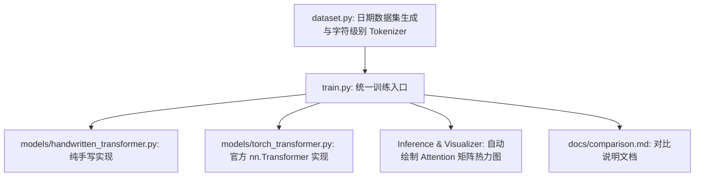

# Transformer 手写与官方封装训练模型实现方案

本项目计划实现一个完整的 Transformer 序列到序列 (Seq2Seq) 训练模型。我们将分别使用**纯手写实现**和**PyTorch官方封装工具**实现两个版本的模型，并设计一个直观的**日期格式转换任务**用于快速训练、评估和注意力机制的可视化对比。

---

## 推荐数据集：日期格式转换 (Date Normalization Task)

为了在不需要 GPU/大规模计算资源且不依赖网络下载的前提下，极其直观、快速地看到 Transformer 的训练效果与注意力对齐，我们强烈推荐**日期格式转换 (Date Normalization) 任务**。

### 1. 任务定义
*   **输入 (Src)**: 各种非标准格式的日期字符串，例如：
    *   `"May 23, 2026"`
    *   `"26/05/2026"`
    *   `"2026-05-23"`
    *   `"May 23 2026"`
    *   `"23-05-26"`
*   **输出 (Tgt)**: 统一的标准 ISO 格式日期，即 `"2026-05-23"`。

### 2. 为什么推荐该数据集？
1.  **无需外部下载**：通过 Python 内置的 `datetime` 和 `random` 库即可在本地自动生成上万条的高质量样本，无网络依赖，100% 可复现。
2.  **训练极快 (CPU友好)**：参数量极小。在 CPU 环境下，通常仅需训练 2~3 个 Epoch（耗时约 1~2 分钟），准确率即可达到 98% 以上。
3.  **高度可视化**：在将输入（如 `"May 23, 2026"`）翻译为输出（如 `"2026-05-23"`）时，模型会学会显著的**注意力对齐**。例如，当输出年 `"2026"` 时，解码器对输入中的 `"2026"` 或 `"26"` 的注意力会激增；输出月 `"05"` 时对 `"May"` 关注度最高。我们可以非常直观地画出注意力权重矩阵热力图（甚至在控制台用字符画显示）。

---

## 整体架构设计

我们将项目代码划分为三个部分：数据处理与 Tokenizer、模型定义（手写 vs 官方）、统一的训练与可视化脚本。



---

## Proposed Changes

### 1. 数据处理模块

#### [NEW] [dataset.py](file:///f:/PyProject/Transformer_demo/work_01/dataset.py)
*   **功能**：
    1.  生成包含数万条多样化格式日期的平行语料库。
    2.  实现一个轻量级的 `CharacterTokenizer`，用于将输入/输出字符串编码为 Token ID，支持特殊 Token：`<pad>` (0), `<sos>` (1), `<eos>` (2), `<unk>` (3)。
    3.  继承 PyTorch 的 `Dataset` 并实现 `DataLoader` 自动批处理和 Padding 填充。

### 2. 模型模块

#### [NEW] [handwritten_transformer.py](file:///f:/PyProject/Transformer_demo/work_01/models/handwritten_transformer.py)
*   **功能**：从零构建完整的 Transformer 模型，不使用 PyTorch 的 `nn.Transformer` 等高层 API。
*   **具体组件**：
    1.  `PositionalEncoding` (正弦/余弦位置编码)。
    2.  `MultiHeadAttention` (多头注意力，支持 Self-Attention 和 Cross-Attention，支持 Masking)。
    3.  `PositionwiseFeedForward` (前馈神经网络)。
    4.  `EncoderLayer` & `DecoderLayer` (包含残差连接和 LayerNorm)。
    5.  `Encoder` & `Decoder` (多层堆叠)。
    6.  `HandwrittenTransformer` (主模型，管理 Embedding、Encoder、Decoder 及最后的输出投影)。

#### [NEW] [torch_transformer.py](file:///f:/PyProject/Transformer_demo/work_01/models/torch_transformer.py)
*   **功能**：使用 PyTorch 官方封装的底层模块来实现同样的架构。
*   **具体组件**：
    1.  使用 `nn.Transformer` (或者组合 `nn.TransformerEncoder` 和 `nn.TransformerDecoder`)。
    2.  为了与手写模型保持完全对齐，保留相同的 Token Embedding、PositionalEncoding 以及最后的 Linear 输出投影。
    3.  实现适当的 `src_key_padding_mask`、`tgt_key_padding_mask` 和 `memory_key_padding_mask`，以及解码器所必须的因果遮罩 (Causal Look-Ahead Mask)。

### 3. 训练与可视化模块

#### [NEW] [train.py](file:///f:/PyProject/Transformer_demo/work_01/train.py)
*   **功能**：
    1.  统一的命令行参数控制（`--model handwritten/torch`、`--epochs`、`--batch_size`、`--lr`）。
    2.  加载数据集，划分训练集 and 验证集。
    3.  训练循环：使用 CrossEntropyLoss，自动跳过 `<pad>`。
    4.  推理与预测：输入任意日期，转换为标准 ISO 格式，并输出推理结果。
    5.  **注意力可视化**：提取模型前向传播中的 cross-attention 权重，使用 `matplotlib` 绘制热力图并保存为图片，或者在命令行控制台直接打印 ASCII 热力图。

### 4. 文档模块

#### [NEW] [comparison.md](file:///f:/PyProject/Transformer_demo/work_01/docs/comparison.md)
*   **功能**：从以下维度深度对比手写版本和官方封装工具：
    1.  **代码复杂性与结构**：模块化拆分、底层张量维度变换的易读性。
    2.  **前向传播计算图**：手写拆分/合并维度 vs 官方底层的 C++/CUDA 融合核优化（如 Fast Path, FlashAttention）。
    3.  **参数与内存效率**：参数对齐细节、缓存管理（如因果遮罩的处理方式）。
    4.  **实测性能**：在相同 Batch Size 和 Epoch 下的训练速度（Tokens/sec）、最终精度收敛曲线。

---

## Verification Plan

### Automated Tests
1.  **模型参数与形状检验**：
    *   在两款模型初始化后，输入相同尺寸的 Dummy Tensor，验证其输出 Tensor 形状是否均为 `[Batch, Seq_Len, Vocab_Size]`。
2.  **训练正确性检验**：
    *   在生成的日期数据集上运行 2 个 Epoch 的训练，验证 Loss 是否处于持续下降趋势，且 Validation Set 的 Accuracy 大于 80%。
3.  **推理测试**：
    *   输入非标准格式，如 `"July 4, 1776"` 或 `"2026/05/23"`，验证输出是否为 `"1776-07-04"` 和 `"2026-05-23"`。
4.  **注意热力图生成测试**：
    *   验证在推理结束后是否成功生成并保存注意力矩阵图像，或者在控制台输出清晰的 ASCII 注意力热力图。

### Manual Verification
*   在命令行运行以下命令，分别测试手写版和官方版的训练与推理，并检查生成的 `comparison.md` 文档：
    ```powershell
    python train.py --model handwritten --epochs 3
    python train.py --model torch --epochs 3
    ```
